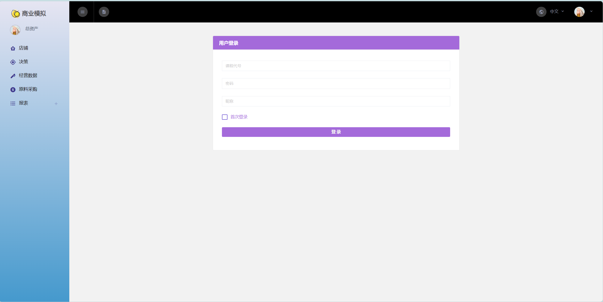
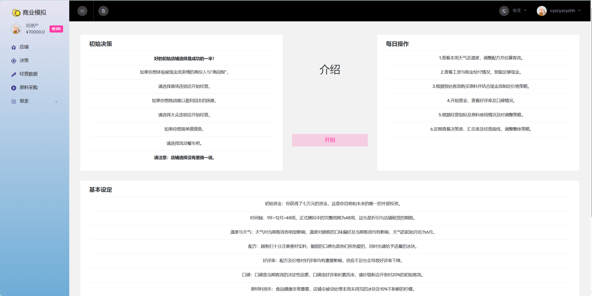
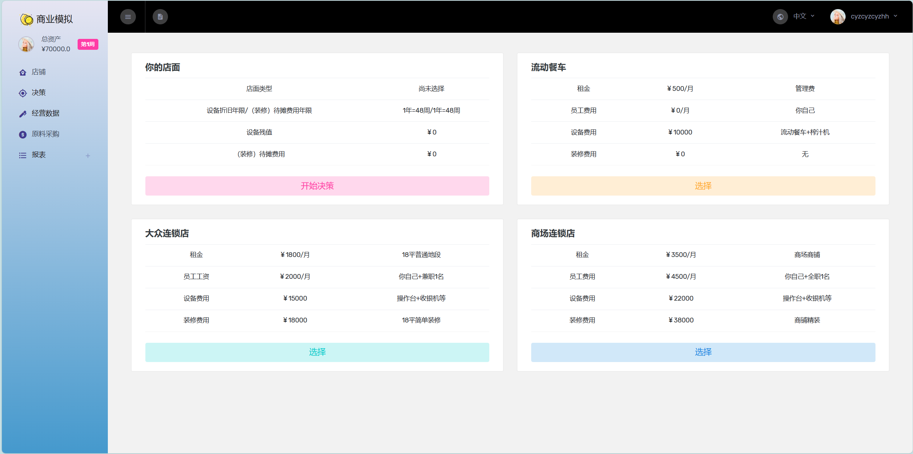
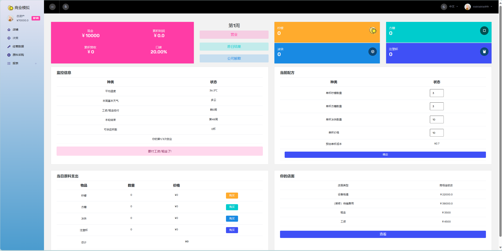
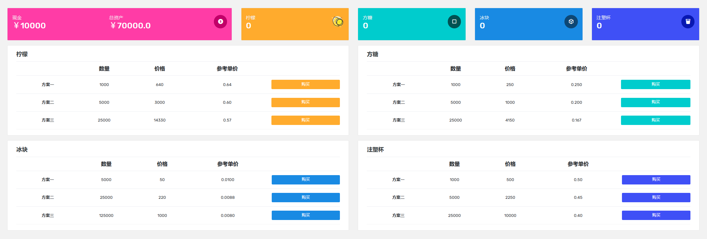
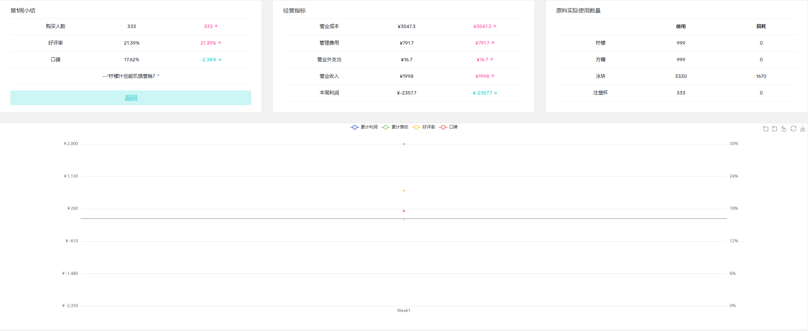

## 
项目体验：http://36.138.2.29:65510

## 用户教程：

### 用户登录界面

- 课程代号：Pub_test 
- 密码：12345
- 昵称：根据个人喜好而定
- 如果首次登录则勾选，否则直接点击“登录”按钮即可
    
### 介绍

- 阅读介绍页面的初始决策、每日操作、基本设定
- 阅读完成后，点击“开始”按钮

### 进行经营

- 选择店面
    
    - 从三个店铺中精心挑选一个适合自己经营理念的店铺作为您的店铺
    - 点击“选择”按钮后，点击“开始经营”按钮，开始您的柠檬水初创业之旅
- 决策
    
    
    - 决策页面上方的五个方块分别表示店铺情况（现金，累计利润，累计营收，口碑（口碑会影响人数））以及各个原料的剩余数量
    
    - 根据左上角“监控信息”的表格进行决策（温度和天气会影响消费者的口感以及人数），此外第一天需要支付租金和资金，请谨慎采购原料。
    - 可以通过修改右上角“当前配方”修改原料的数量以及柠檬水的单价。
    - 点击左下角“每日原料支出”中的购买按钮，会进入下面的采购页面。
        
        
        - 采购页面上方所显示的五个方块与决策页面显示的同步。
        - 根据您所需要的原料数量，选择合适的方案进行购买。
    - 右下角的“你的店面”表格让您牢记需要支付的工资和租金费用，以及店铺的折旧价格。
    - 一切准备就绪后，即可点击“营业”按钮！下图为经营一周后的结果：
        
    - 营业一周后，可以点击“昨日结果”查看前一周的经营情况和消费者反馈，和上面的图一致。也可以点击左侧的报表查看详细各个表的数据。
    - 当然，觉得需要重新开一个店铺时，您也可以选择点击“公司解散”按钮，进行人生重来！
##

## v0.0
#### 想法
- 故事背景应该是个重要的事情
虽然是抄但希望抄出一个有故事的模拟起码是个中国版不是个游戏的汉化
- 
- 试玩应该无限制条件    合理解释经验也是一部分
正式阶段的 破产 就等同退出竞争了

  
不能线性扩张
- 制作时间 也应当加入考虑 店员 
- 固定资产 排队时间  开新店

## 模型
## v1.0
### 交互、界面问题

#### 经营界面
- [x] 二级开始界面 开始界面分当天的提示面板和前一天的经营结果概览。 
改成结果概览-经营准备  结果概览作为经营准备的二级 辅助作用
- [ ] 结果概览调整
- [x] 试玩时第一天 也可以破产 破产/重新开始和切换按钮布局
- [x] 配方加个返回
- [x] 初始指引  
- 
#### 教学目的内容
- [ ] 报表界面分现金流量表 利润表 和决策表
#### 教师端/管理员界面
- [ ] 定周期监控

#### 模型问题
- 分多个版本 目前按照试玩开发 
- 加权平均法算成本

~~冰块参数微调  0时也有一定值  不大对 设置配方为0 和没买是两回事情~~
- [ ] 保鲜设定 除冰块外 剩余的库存也会有损失 类似可以定周期盘点一次
- [ ] 库存竞争 
- [ ] 市场竞争

## v1.1
- 配方价格不得设0
- 配方界面确定即返回
- 价格太低  反馈偏离了物价水平 
- 天气中文 天气数值调整 1 以下方便估计 放大影响
- 教师页面
- 现金流量表

## v1.2
- 房租
